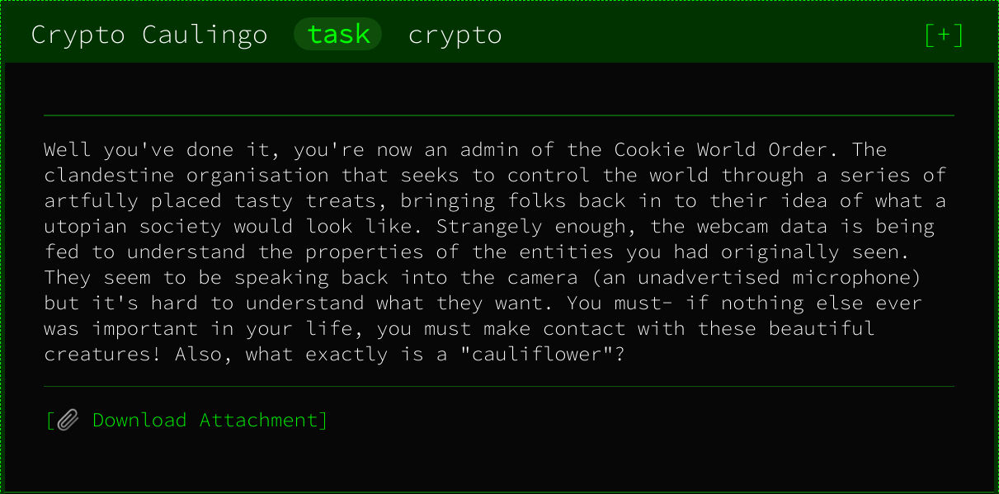
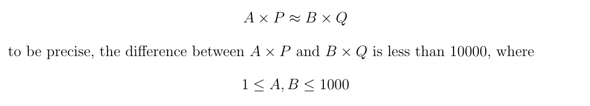
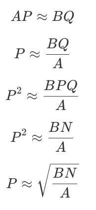

# Crypto Caulingo

## Challenge Description



The initial challenge description doesn't include a whole lot of information, however for this challenge there was also a PDF file included which goes into a little more detail. Ignoring the fluff, we can boil it down to a couple of key points:

* We're dealing with RSA
* We are given, `n` and `e`, but not `p` and `q`
* `p` and `q` have been selected based on the rule shown below



With the introduction of these constants we can actually infer quite a bit about the potential `p` and `q` values which may be chosen.



So now we can represent `p` purely in terms of `a` `b` and `n`, however, we still need to deal with that pesky approximation. The question is how far our estimation of P is likely to be out from the actual value, and intuitively, when dealing with such large numbers, a difference of 10,000 is most likely a relatively small change in the value of P. So lets find out.

The simplest method to test this is to brute force all combinations of `a` & `b`, calculate an approximation of `p` based on those values, and the search values immediately around the estimated `p`, calculating a corresponding `q` for each and ensuring that their product works out to be `n`. Generally, my language of preference is python, but in this case I felt speed was probably a priority, so I ended up writing the code in C, using [GMP](https://gmplib.org/) to handle the maths for integers of arbitrary size.

The code I wrote is below, I decided to start with searching 10 either side of the approximate `p` value calculated, and surprisingly, found the result almost straight away. The code used is below

```C
#include <gmp.h>
#include <stdio.h>
#include <time.h>

int solve() {
    mpz_t n;
    mpz_init_set_str(n, "17450892350509567071590987572582143158927907441748820483575144211411640241849663641180283816984167447652133133054833591585389505754635416604577584488321462013117163124742030681698693455489404696371546386866372290759608301392572928615767980244699473803730080008332364994345680261823712464595329369719516212105135055607592676087287980208987076052877442747436020751549591608244950255761481664468992126299001817410516694015560044888704699389291971764957871922598761298482950811618390145762835363357354812871474680543182075024126064364949000115542650091904557502192704672930197172086048687333172564520657739528469975770627", 10);
    mpz_t p, P, q, c, d, N, I; // p, q and intermediates
    mpz_inits(p, P, q, c, d, N, I, NULL);

    for (unsigned int a = 1; a < 1001; a++){
        for (unsigned int b = 1; b < 1001; b++){
            // Calculate approximate p
            mpz_mul_ui(c, n, b); // c = n*b
            mpz_fdiv_q_ui(d, c, a); // d = (n*b)/a
            mpz_root(P, d, 2); // p = sqrt((n*b)/a)

            // Handle approximation by searching nearby possibilities
            for (int i = -10; i<11; i+=2){
                mpz_set_si(I, i);
                mpz_add(p, P, I);
                // Get potential q value
                mpz_fdiv_q(q, n, p);
                // Verify that p*q produces the correct product
                mpz_mul(N, p, q);
                // Check for == 0 because it returns in range [-1,1]
                if(mpz_cmp(n, N) == 0){
                    gmp_printf("\nFound valid p and q:\np: %Zd\nq: %Zd\n", p, q);
                    printf("A: %d\nB: %d\n", a, b);
                    printf("Actually only %d out in approximation \n", i);
                }
            }
        }
        printf("\ra=%d",a);
        fflush(stdout);
    }
}

int main(int argc, char const *argv[]) {
    clock_t start, end;
    double cpu_time;
    start = clock();
    solve();
    end = clock();
    cpu_time = ((double) (end - start)) / CLOCKS_PER_SEC;
    printf("\nTime taken: %f\n", cpu_time);
    return 0;
}

```

and the output we see:

```
Found valid p and q:
p: 151086174643947302290817794140091756798645765602409645643205831091644137498519425104335688550286307690830177161800083588667379385673705979813357923016141205953591742544325170678167010991535747769057335224460619777264606691069942245683132083955765987513089646708001710658474178826337742596489996782669571549253
q: 115502906812186413716028212900548735990904256575141882752425616464266991765240920703188618324966988373216520827723741484031611192826120314542453727041306942082909556327966471790487878679927202639569020757238786152140574636623998668929044300958627146625246115304479897191050159379832505990011874114710868929959
A: 607
B: 794
Final p different 8 out from approximation
Time taken: 6.488865s
```

Great! Now we can decrypt the message.

The initial parameters we were given in the challenge were:
```
n:
17450892350509567071590987572582143158927907441748820483575144211411640241849663641180283816984167447652133133054833591585389505754635416604577584488321462013117163124742030681698693455489404696371546386866372290759608301392572928615767980244699473803730080008332364994345680261823712464595329369719516212105135055607592676087287980208987076052877442747436020751549591608244950255761481664468992126299001817410516694015560044888704699389291971764957871922598761298482950811618390145762835363357354812871474680543182075024126064364949000115542650091904557502192704672930197172086048687333172564520657739528469975770627

e:
65537

msg:
50fb0b3f17315f7dfa25378fa0b06c8d955fad0493365669bbaa524688128ee9099ab713a3369a5844bdd99a5db98f333ef55159d3025630c869216889be03120e3a4bd6553d7111c089220086092bcffc5e42f1004f9888f25892a7ca007e8ac6de9463da46f71af4c8a8f806bee92bf79a8121a7a34c3d564ac7f11b224dc090d97fdb427c10867ad177ec35525b513e40bef3b2ba3e6c97cb31d4fe3a6231fdb15643b84a1ce704838d8b99e5b0737e1fd30a9cc51786dcac07dcb9c0161fc754cda5380fdf3147eb4fbe49bc9821a0bcad98d6df9fbdf63cf7d7a5e4f6cbea4b683dfa965d0bd51f792047e393ddd7b7d99931c3ed1d033cebc91968d43f
```

So, if we do a quick conversion to decimal and plug our keys, message and exponent into an [online RSA implementation](https://www.cryptool.org/en/cto-highlights/rsa-step-by-step) (the lazy way). We get a final message of:

```
Hey there!
If you are able to decrypt this message, you must a life form with high intelligence!
Therefore, we would like to invite you to our dancing party!
Here's your invitation code: CTF{017d72f0b513e89830bccf5a36306ad944085a47}
```

and there we have the flag, solved!
